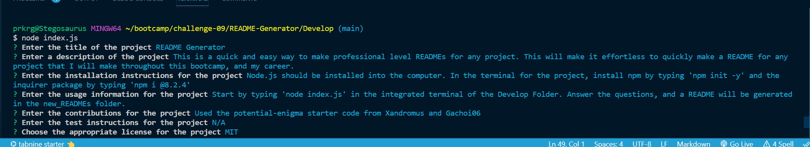
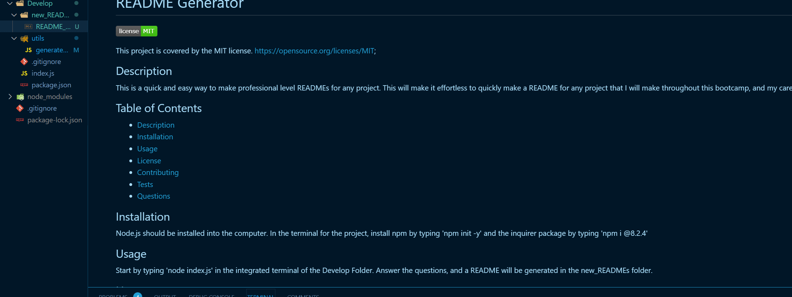

<!-- @format -->

# README Generator

This project is covered by the MIT license.
https://opensource.org/licenses/MIT;

## Description

This is a quick and easy way to make professional level READMEs for any project. This will make it effortless to quickly make a README for any project that I will make throughout this bootcamp, and my career.

## Table of Contents

- [Description](#description)
- [Installation](#installation)
- [Usage](#usage)
- [License](#license)
- [Contributing](#contributing)
- [Tests](#tests)
- [Questions](#questions)

## Installation

Node.js should be installed into the computer. In the terminal for the project, install npm by typing 'npm init -y' and the inquirer package by typing 'npm i @8.2.4'

## Usage

Start by typing 'node index.js' in the integrated terminal of the Develop Folder and answer the questions.  
 
  
 
A README will be generated in the new_READMEs folder.  
 

## License

This project is covered by the MIT license.
https://opensource.org/licenses/MIT;

## Contributing

Used the potential-enigma starter code from Xandromus and Gachoi06

## Tests

N/A

## Questions

Contact [prkrgreenwell](https://github.com/prkrgreenwell) on GitHub with any questions you may have
